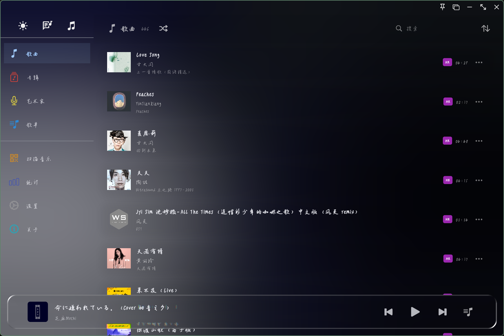
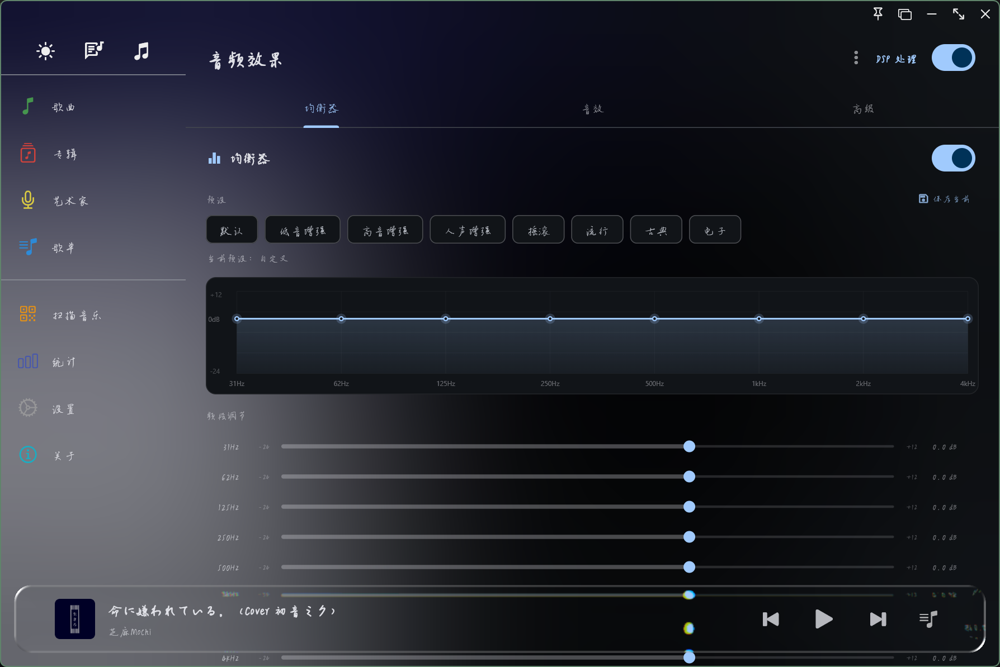
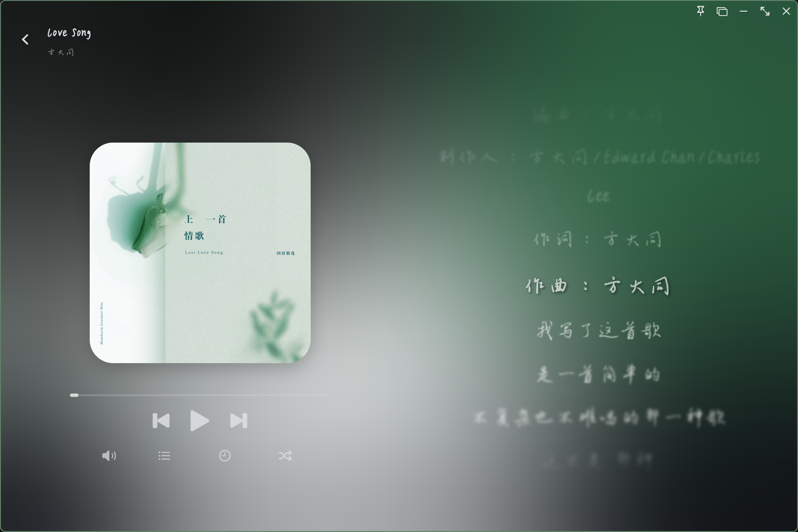

# 🎵 LocaL Music Player

一款基于 Flutter 开发的现代化本地音乐播放器，采用 Material Design 3 设计风格，提供流畅的用户体验和丰富的音频处理功能。


## ✨ 功能特点

### 🎶 音乐播放
- 🎵 **多格式支持**：支持 MP3、FLAC、WAV 等多种音频格式
- 🔍 **智能扫描**：快速扫描本地音乐文件，自动提取元数据和封面
- 📋 **播放列表**：创建和管理自定义播放列表
- 📊 **音乐统计**：提供播放统计和音乐数据分析
- 🖼️ **专辑管理**：按专辑和艺术家浏览音乐
- 🔤 **自定义字体**：支持自定义应用字体
- 📊 **歌曲排序缓存**：记住歌曲列表排序状态

### 🎛️ DSP 音频处理
- 🎚️ **8 段均衡器**：支持自定义均衡器预设，内置多种风格预设
- 🔉 **低音增强**：Bass Boost 低音增强效果
- 🗣️ **回声效果**：Echo 回声/延迟效果
- 🏛️ **混响效果**：Reverb 空间混响效果
- 🌊 **镶边效果**：Flanger 镶边/合唱效果
- 🎼 **变调**：Pitch Shift 实时变调
- 📉 **压缩器**：Compressor 动态压缩
- 🔒 **限幅器**：Limiter 音频限幅
- 📡 **波形塑形**：WaveShaper 波形塑形/失真效果
- 🤖 **机器人效果**：Robotize 机器人声效果
- 📼 **Lo-Fi 效果**：LoFi 复古低保真效果
- 🔔 **共振滤波**：Biquad Resonant 共振滤波器

### 📝 歌词功能
- 🎤 **歌词显示**：支持歌词显示和滚动同步
- 🖥️ **桌面歌词**：独立窗口桌面歌词，支持拖拽和样式自定义
- 🌫️ **歌词模糊**：未播放歌词模糊效果，增强视觉层次
- ⚙️ **歌词样式**：自定义歌词字体大小、颜色、高亮等

### 🎨 界面与主题
- 🎨 **主题切换**：支持深色/浅色主题，可自定义主题颜色
- 🖊️ **字体自定义**：支持导入自定义字体文件
- 🎭 **玻璃拟态**：采用现代化的玻璃拟态设计风格
- 🌊 **流体背景**：动态流体渐变背景效果
- 🖼️ **UI 设计参考**：部分 UI 参考了 Salt Music、网易云等音乐软件

### 🖥️ 桌面功能
- 📌 **系统托盘**：最小化到系统托盘，支持右键菜单控制
- 🎵 **播放栏**：独立迷你播放栏窗口，快速控制播放
- 🪟 **多窗口**：支持多窗口独立运行（桌面歌词、播放栏等）

## 📸 部分截图






## 🛠️ 技术栈

### 核心框架
- **Flutter** - 跨平台 UI 框架
- **Provider** - 状态管理

### 音频处理
- **flutter_soloud** - 高性能音频引擎，支持 DSP 音频效果处理
- **audio_metadata_reader** - 音频元数据读取

### UI 组件
- **fluid_background** - 流体背景效果
- **liquid_glass_easy** - 玻璃拟态效果
- **flutter_colorpicker** - 颜色选择器
- **animations** - 动画效果
- **flutter_lyric** - 歌词显示与滚动
- **cached_network_image** - 网络图片缓存
- **fl_chart** - 图表组件
- **palette_generator** - 调色板生成器
- **smooth_corner** - 平滑圆角组件

### 数据存储
- **hive** - 本地数据库
- **hive_flutter** - Hive的Flutter插件
- **shared_preferences** - 轻量级本地存储

### 桌面功能
- **window_manager** - 窗口管理
- **tray_manager** - 系统托盘管理
- **desktop_multi_window** - 多窗口支持

### 工具类
- **file_picker** - 文件选择
- **path_provider** - 路径获取
- **path** - 路径处理
- **dio** - 网络请求
- **url_launcher** - URL 启动器
- **uuid** - UUID 生成器
- **intl** - 国际化支持
- **lpinyin** - 拼音转换
- **scrollable_positioned_list** - 可滚动定位列表
- **share_plus** - 分享功能
- **package_info_plus** - 应用信息
- **upnped** - UPnP 设备发现

## 📦 安装步骤

### 前置要求

- Flutter SDK 3.0 或更高版本
- Dart SDK 3.0 或更高版本
- Windows 操作系统

### 克隆项目

```bash
git clone https://github.com/chen040129/LocaL_Music_Player.git
cd LocaL_Music_Player
```

### 安装依赖

```bash
flutter pub get
```

### 运行应用

```bash
flutter run
```

## 📖 使用指南

### 添加音乐

1. 点击侧边栏的"扫描音乐"按钮
2. 选择包含音乐文件的文件夹
3. 等待扫描完成，音乐将自动添加到库中

### 播放音乐

1. 在"歌曲"、"专辑"或"艺术家"页面浏览音乐
2. 点击歌曲开始播放
3. 使用底部播放控制栏控制播放进度、音量等

### DSP 音频效果

1. 点击侧边栏的"DSP"页面
2. 开启 DSP 总开关
3. 选择需要的音频效果（均衡器、低音增强、混响等）
4. 调整各效果参数，实时预览

### 桌面歌词

1. 进入"设置" → "歌词"页面，找到"桌面歌词"部分
2. 开启桌面歌词
3. 可拖拽歌词窗口到任意位置
4. 自定义歌词字体、颜色、大小等样式

### 创建播放列表

1. 进入"歌单"页面
2. 点击创建新歌单
3. 为歌单命名并添加歌曲

### 自定义主题

1. 进入"设置"页面
2. 选择"用户界面"
3. 自定义主题颜色、字体大小、流体背景等

## 📄 开源许可

本项目采用 CC BY-NC 4.0 (署名-非商业性使用 4.0) 许可证 - 详见 [LICENSE](license.txt) 文件

如需将本作品用于商业目的，请联系csy689016@gmail.com获取许可。

## 🤝 贡献

欢迎提交 Issue 和 Pull Request！

## 📮 联系方式

- GitHub Issues: [提交问题](https://github.com/chen040129/LocaL_Music_Player/issues)
- Email: csy689016@gmail.com

## 🙏 致谢

感谢以下开源项目的支持：

### 核心框架
- [Flutter](https://flutter.dev/)
- [Provider](https://pub.dev/packages/provider)

### 音频处理
- [flutter_soloud](https://pub.dev/packages/flutter_soloud) - 高性能音频引擎
- [audioplayers](https://github.com/luanpotter/audioplayers)
- [audio_metadata_reader](https://github.com/SinoAppEngine/audio_metadata_reader)

### UI 组件
- [fluid_background](https://pub.dev/packages/fluid_background)
- [liquid_glass_easy](https://pub.dev/packages/liquid_glass_easy)
- [flutter_colorpicker](https://pub.dev/packages/flutter_colorpicker)
- [animations](https://pub.dev/packages/animations)
- [flutter_lyric](https://github.com/fluttercandies/flutter_lyric)
- [cached_network_image](https://pub.dev/packages/cached_network_image)
- [fl_chart](https://pub.dev/packages/fl_chart)
- [palette_generator](https://pub.dev/packages/palette_generator)
- [smooth_corner](https://pub.dev/packages/smooth_corner)

### 桌面功能
- [window_manager](https://pub.dev/packages/window_manager)
- [tray_manager](https://pub.dev/packages/tray_manager)
- [desktop_multi_window](https://pub.dev/packages/desktop_multi_window)

### 数据存储
- [hive](https://pub.dev/packages/hive)
- [hive_flutter](https://pub.dev/packages/hive_flutter)
- [shared_preferences](https://pub.dev/packages/shared_preferences)

### 工具类
- [file_picker](https://pub.dev/packages/file_picker)
- [path_provider](https://pub.dev/packages/path_provider)
- [path](https://pub.dev/packages/path)
- [dio](https://pub.dev/packages/dio)
- [url_launcher](https://pub.dev/packages/url_launcher)
- [uuid](https://pub.dev/packages/uuid)
- [intl](https://pub.dev/packages/intl)
- [lpinyin](https://pub.dev/packages/lpinyin)
- [scrollable_positioned_list](https://pub.dev/packages/scrollable_positioned_list)
- [share_plus](https://pub.dev/packages/share_plus)
- [package_info_plus](https://pub.dev/packages/package_info_plus)
- [upnped](https://pub.dev/packages/upnped)
